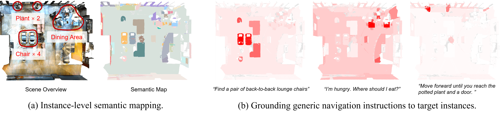

<div align="center">

<h1 style="font-size:28px; font-weight:700; margin-bottom:10px;">
OpenMap: A Zero-shot Open-Vocabulary Visual-Language Mapping Framework for Instruction Grounding
</h1>

<p style="font-size:16px; line-height:1.5; margin-bottom:10px;">
<a href="mailto:lidanyang1919@gmail.com">Danyang&nbsp;Li<sup>*</sup></a>,
<a href="mailto:zenghuiyang36@gmail.com">Zenghui&nbsp;Yang<sup>*</sup></a>,
<a href="mailto:qigp@inspur.com">Guangpeng&nbsp;Qi</a>,
<a href="mailto:pangst@inspur.com">Songtao&nbsp;Pang</a>,
<a href="mailto:shangguangyong@inspur.com">Guangyong&nbsp;Shang</a>,
<a href="mailto:tsinghuamq@gmail.com">Qiang&nbsp;Ma<sup>†</sup></a>,
<a href="mailto:hmilyyz@gmail.com">Zheng&nbsp;Yang</a>
</p>

<p style="font-size:15px; margin-top:-5px;">
Tsinghua University · Central South University · Inspur Yunzhou Industrial Internet Co., Ltd<br>
<i>ACM MM 2025</i><br>
<sup>*</sup>Equal Contribution · <sup>†</sup>Corresponding Author
</p>

<p style="margin-top:10px;">
<a href="https://arxiv.org/pdf/2508.01723.pdf">
  
</a>
<a href="https://github.com/openmap-project/openmap">
  
</a>
<a href="https://arxiv.org/abs/2508.01723">
  
</a>
</p>

<hr style="width:60%; margin:20px auto;">



<p style="font-size:14px; line-height:1.5; text-align:left; max-width:800px; margin:15px auto;">
<strong>OpenMap constructs an open-vocabulary visual-language map.</strong>
(a) OpenMap performs fine-grained, instance-level semantic mapping on navigation scenes from Matterport3D.
(b) OpenMap accurately grounds generic instructions to the targets, where darker regions in the heatmaps indicate stronger alignment between the instruction and the predicted instance.
</p>

<hr style="width:60%; margin:20px auto;">
</div>


## 1 ⚙️ Environment Setup
clone our project:  `git clone https://github.com/openmap-project/OpenMap.git`
### 1.1 Basic Environment

```Bash 
conda create --name  openmap python=3.8 
conda activate openmap 
conda install -y pytorch==2.0.0 torchvision==0.15.0 pytorch-cuda=11.8 -c pytorch -c nvidia
```

mmengine installation:

```Bash
pip install -U openmim 
python -m pip install https://github.com/openmmlab/mmengine/archive/refs/tags/v0.8.5.zip
```

mmcv installation (note that older version mmcv before this commit may cause bugs):
```Bash
TORCH_CUDA_ARCH_LIST="{COMCAP}" TORCH_NVCC_FLAGS="-Xfatbin -compress-all" CUDA_HOME=$(dirname $(dirname $(which nvcc))) LD_LIBRARY_PATH=$(dirname $(dirname $(which nvcc)))/lib MMCV_WITH_OPS=1 FORCE_CUDA=1 python -m pip install git+https://github.com/open-mmlab/mmcv.git@4f65f91db6502d990ce2ee5de0337441fb69dd10
```

Please determine the Compute Capability (COMCAP) of your GPU:
```Text
What is the `Compute Capability` of NVIDIA {YOUR GPU MODEL}? Please only output the number, without text.
```

Other relevant packages:
```Bash
python -m pip install \ https://github.com/open-mmlab/mmdetection/archive/refs/tags/v3.1.0.zip \ https://github.com/open-mmlab/mmsegmentation/archive/refs/tags/v1.1.1.zip \ https://github.com/open-mmlab/mmpretrain/archive/refs/tags/v1.0.1.zip python -m pip install git+https://github.com/cocodataset/panopticapi.git \ git+https://github.com/HarborYuan/lvis-api.git \ tqdm terminaltables pycocotools scipy tqdm ftfy regex timm scikit-image kornia
```

### 1.2 CropFormer and CLIP installation

The official installation of Cropformer is composed of two steps: installing detectron2 and then Cropformer. For your convenience, I have combined the two steps into the following scripts. If you have any problems, please refer to the original [Cropformer](https://github.com/qqlu/Entity/blob/main/Entityv2/CropFormer/INSTALL.md) installation guide.
```Bash
cd third_party 
git clone git@github.com:facebookresearch/detectron2.git 
cd detectron2 pip install -e . 
cd ../ 
git clone git@github.com:qqlu/Entity.git 
cp -r Entity/Entityv2/CropFormer detectron2/projects 
cd detectron2/projects/CropFormer/entity_api/PythonAPI 
make 
cd ../.. 
cd mask2former/modeling/pixel_decoder/ops 
sh make.sh
```

We provide an additional script in CropFormer to sequentially process all input sequences.

```Text
# modify third_party/detectron2/projects/CropFormer/demo_cropformer/predictor.py ..mask2former third_party/detectron2/projects/CropFormer/mask2former/modeling/criterion_view.py ..util
```

Finally, download the [CropFormer checkpoint](https://huggingface.co/datasets/qqlu1992/Adobe_EntitySeg/tree/main/CropFormer_model/Entity_Segmentation/Mask2Former_hornet_3x) and modify the 'cropformer_path' variable in script.py.

Install the open clip library by `pip install open_clip_torch`
For the checkpoint, when you run the script, it will automatically download the checkpoint. However, if you want to download it manually, you can download it from [here](https://huggingface.co/laion/CLIP-ViT-H-14-laion2B-s32B-b79K/tree/main) and set the path when loading CLIP model using 'create_model_and_transforms' function.


### 1.3 Installation of Additional Dependencies

```Bash
pip install -r requirements.txt 
pip install timm==1.0.14 
```


## 2 Data Preparation
### 2.1 ScanNet
Please follow the official [ScanNet](http://www.scan-net.org/ScanNet/) guide to sign the agreement and send it to [scannet@googlegroups.com](mailto:scannet@googlegroups.com). After receiving the response, you can download the data. We use only the scannet validation split, which contains 312 scenes. You only need to download the ['.aggregation.json',  '.sens', '.txt', '_vh_clean_2.0.010000.segs.json',  '_vh_clean_2.ply',  '_vh_clean_2.labels.ply'] files. Please also set the 'label_map' on to download the 'scannetv2-labels.combined.tsv' file. After downloading, you will get the following folder structure .
```
data/scannet
  ├──raw
      ├──scans
	      ├──scene0011_00
		      ├──scene0011_00.sens
		      ├──scene0011_00_vh_clean_2.ply
		      ├──scene0011_00.0.010000.segs.json
		      ├──scene0011_00_vh_clean_2.aggregation.json
		      ├──scene0011_00_vh_clean_2.labels.ply'
		      ├──scene0011_00.txt
		  ├──scene0011_01
		  ├──...
  └── scannetv2-labels.combined.tsv
```
After downloading the data, run the following script to preprocess it. Please update the 'raw_data_dir', 'target_data_dir', 'split_file_path', 'label_map_file' and 'gt_dir' variables before you run.
```shell
cd dataset/preprocess/scannet
python process_val.py
python prepare_gt.py
```

After running the script, the resulting directory structure will be:

```
data/scannet
  ├── processed
      ├── scene0011_00
          ├── pose                            <- folder with camera poses
          │      ├── 0.txt 
          │      ├── 10.txt 
          │      └── ...  
          ├── color                           <- folder with RGB images
          │      ├── 0.jpg  (or .png/.jpeg)
          │      ├── 10.jpg (or .png/.jpeg)
          │      └── ...  
          ├── depth                           <- folder with depth images
          │      ├── 0.png  (or .jpg/.jpeg)
          │      ├── 10.png (or .jpg/.jpeg)
          │      └── ...  
          ├── intrinsic                 
          │      └── intrinsic_depth.txt       <- camera intrinsics
          |      └── ...
          └── scene0011_00_vh_clean_2.ply      <- point cloud of the scene
  └── gt                                       <- folder with ground truth 3D instance masks
      ├── scene0011_00.txt
      └── ...
```


### 2.2 [MatterPort3D](https://github.com/PKU-EPIC/MaskClustering#matterport3d)

Please follow the official [MatterPort3D](https://github.com/niessner/Matterport) guide to sign the agreement and download the data. We use a subset of its testing scenes to ensure Mask3D remains within memory constraints. The list of scenes we use can be found in splits/mpr2r.txt. Download only the following:  ['undistorted_color_images', 'undistorted_depth_images', 'undistorted_camera_parameters', 'house_segmentations']. Upon download, unzip the files. The expected directory structure is as follows (paths in 'dataset/preprocess/matterport3d/process.py' and 'dataset/matterport.py' can be modified if needed):

```
data/matterport3d/scans
  ├── 2t7WUuJeko7
      ├── 2t7WUuJeko7
          ├── house_segmentations
          |         ├── 2t7WUuJeko7.ply
          |         └── ...
          ├── undistorted_camera_parameters
          |         └── 2t7WUuJeko7.conf
          ├── undistorted_color_images
          |         ├── xxx_i0_0.jpg
          |         └── ...
          └── undistorted_depth_images
                    ├── xxx_d0_0.png
                    └── ...
  ├── ARNzJeq3xxb
  ├── ...
  └── YVUC4YcDtcY
```

Please change the `category_mapping` path in dataset/reprocess/matterport3d/constants.py, and `raw_data_dir`,`gt_dir`, `split_file_path` in  dataset/reprocess/matterport3d/process.py, then run the following script to prepare the ground-truth annotations:

```shell
cd dataset/preprocess/matterport3d
python process.py
```


## 3 🚀Running Experiments
Before running experiments, please modify the `project_root` field in `conf/base_config.yaml` and the checkpoint file path in `third_party/ovsam/sam_r50x16_fpn.py`. 
Download all checkpoint files from [here](https://drive.google.com/drive/folders/1s_xgaooY_vQOIRDRtlik2YBZpe7_mc7G) and place them under `${project_root}/third_party/ovsam/ckpt/`.

You can run the entire pipeline with a single command：
```Bash
bash run.sh
```
Alternatively, you can run the pipeline step by step (make sure to adjust the configuration files according to your directory structure):
```Bash
#!/bin/bash 
python -m apps.get_segmentation 
python -m third_party.ovsam.semantic_handler 
python -m apps.setup_graph
python -m apps.get_clip_feature 
python -m apps.export_instances 
python -m evaluation.evaluate
```
